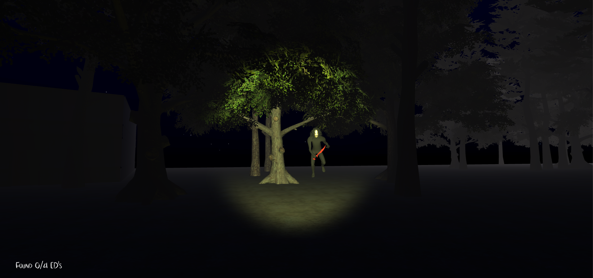
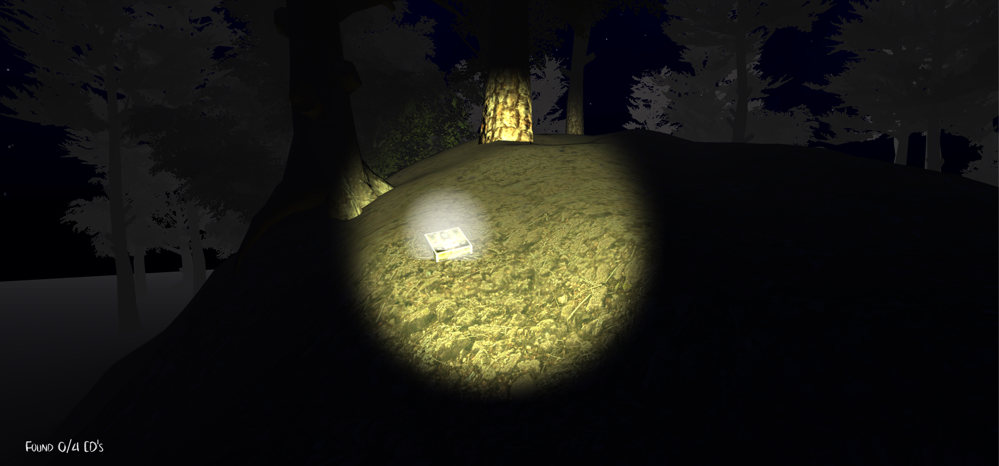
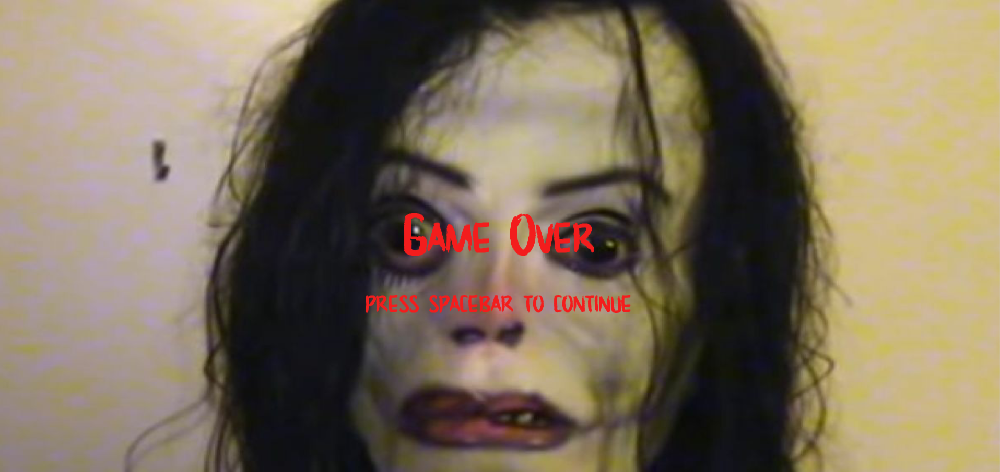

# Ayuwoki Run

**Virtual Environments Agent Programming** | *Universidad Panamericana 2019*

**Teacher:** Linda Jimena Hernández  
**Student:** Luis Enrique Correa Morán  
  
0186950
April 2019

## Table of Contents  

* [Concept](#concept)
* [Game Mechanics](#game-mechanics)  
* [Levels](#levels)  
* [Programming Elements](#programming-elements)
* [Screenshots](#screenshots)

## Concept

Ayuwoki Run is a survival horror 3D game, that resembles the widely popular *Slender: The Eight Pages* from 2012.

## Game Mechanics

The objective of the game is to collect four of Michael Jackson's most famous studio albums, without the Ayuwoki catching you. As soon as you collect them, the Ayuwoki's spirit will be freed from this world.

The player will be able of moving within a forest, interacting with some objects along the way. It gets pretty dark in the forest, and with no light sources, the player will rely on an on-hand lamp to move trhough the woods. Each second that passes with a light turned on, the Ayuwoki will start to chase the player. Don't let him touch you, or you'll be dead before you hear "Hee Hee".

### Camera

The game uses a simple orthogonal camera that follows the main player throughout the game from a unique perspective. As well as a secondary camera that shows a different perspective when the Ayuwoki is either near or he's got you.

## Levels

There's a single level, but the Ayuwoki's speed gets progressively harder the more Albums you collect.

## Programming Elements

Several programming elements were implemented so that the game couldbe both fun and functional. such principles are explained below.

### Terrain

There's a wide terrain, set up with haunted forest assets and fog, to give a creepy look. There's custom elevations and modified trees to optimize performance. Each tree (imported from standard assets) had about 13 colliders. The number was reduced to improve performance, as compromises in collision details on the top sections of a tree were not relevant for the gameplay.

### Colliders & Rigidbody2D

Collisions and Rigidbody components are managed in such a way that they make possible to detect meaningful events and make the Player interact with its environment. For example GameOver conditions, album interaction and Ayuwoki behaviour are implemented under these principles.

### Animations

Basic animations were used to represent mainly the Ayuwoki's state. He is always on idle mode while not chasing but quickly (and scarily) changes to a running one as soon as you turn on your flashlight.

### Audio

Sounds come primarily from two sources, in Ayuwoki's case sounds are played when he starts chasing the player or when he wins. The second source is embodied by the GameController (empty object) contains the ambient music for the game, which plays back in loop.

The ayuwoki will also perform noises when he is close enough.

### Health System

The player only has one life to get as far as he can. As soon as the Ayuwoki gets close enough, the game is over.

At the same time, each recovered album decrases the Ayuwoki's health considerably.

## Screenshots

Some images of the final game.

### Main Screen

### Main Game

### Game Over

